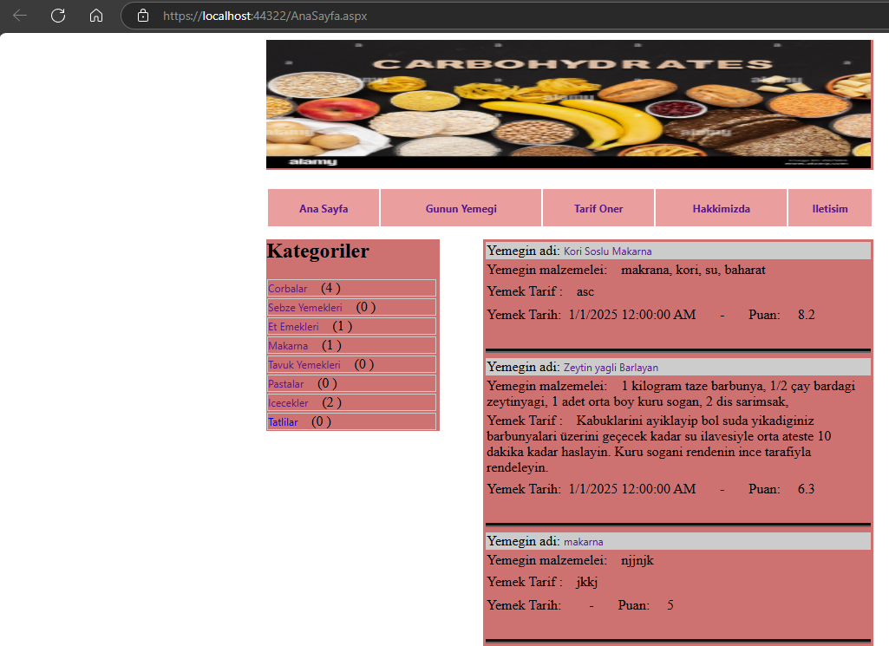
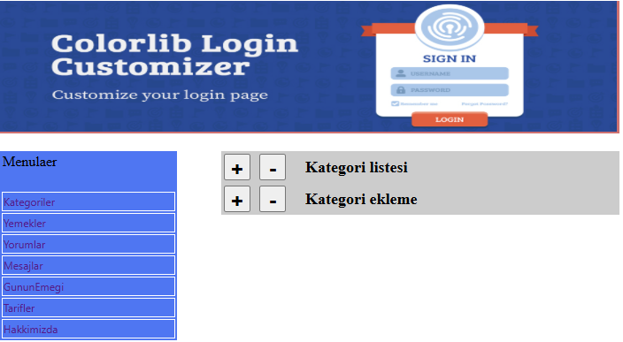
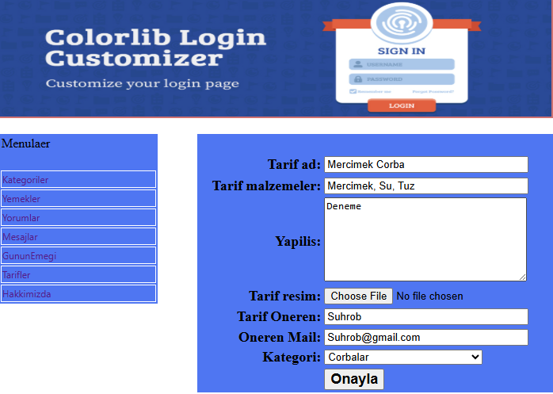

# 🍽️ Yemek Tarif Sistemi – ASP.NET ile Web Projesi

Bu proje, 🎓 **Murat Yücedağ** hocamızın hazırladığı **"50 Derste ASP.NET ile Yemek Tarifi Sitesi"** eğitim serisi kapsamında geliştirilmiştir. Temel web geliştirme teknikleriyle hazırlanmış, şık ve fonksiyonel bir yemek tarifi platformudur.

---

## 📌 Proje Özellikleri

🔎 **Kategori & Tarif Listeleme**  
📝 **Yeni Tarif Ekleme ve Düzenleme (Admin Panel)**  
✅ **Onay Bekleyen Tarifler için Moderasyon**  
👨‍🍳 **En Beğenilen Tarifleri Gösterme**  
💬 **Yorum Yapma ve Görüntüleme**  
📅 **Günün Tarifi Seçme**  
📈 **Sitede Tarif Sayılarını Dinamik Gösterme**

---

## 🚀 Kullanılan Teknolojiler

- 🌐 **ASP.NET Web Forms**
- 🎯 **C#**
- 🎨 **HTML, CSS**
- 📋 **DataList, Panel, SQL**
- 🗂️ **Admin Paneli**
- 🧮 **Stored Procedure & SQL Komutları**

---

## 🧩 Uygulama Görselleri

